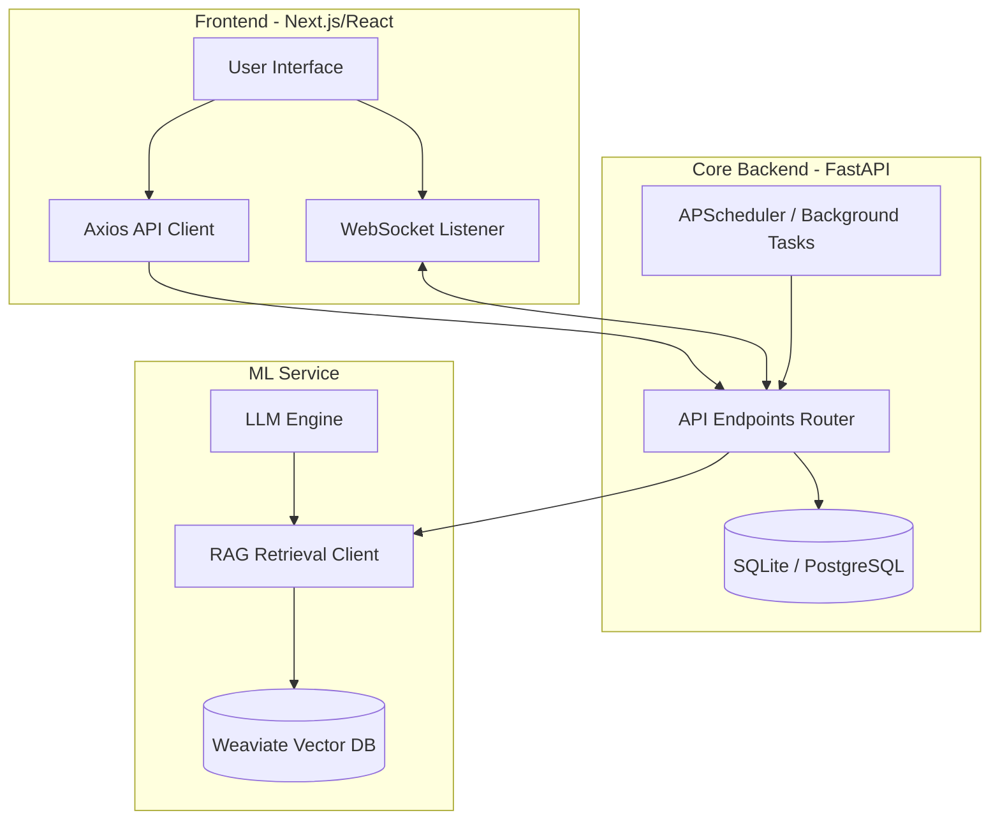

# Finsight System Architecture Blueprint

This document details the system architecture of the Finsight application, detailing the roles and relationships of each component layer.

---

## High-Level System Architecture

Finsight consists of three primary modules:
1. **Frontend UI**: Application built using Next.js (App Router) and React, styled with Tailwind CSS v4.
2. **Core Backend (FastAPI)**: Manages database persistence, authentication, onboarding answers, and subscription tiers (all tiers are free).
3. **ML Service**: Performs real-time sentiment analysis, RAG (Retrieval-Augmented Generation) document search, and structured insights classifications.

---

## Modules Breakdown

### 1. Core Backend (FastAPI)
- **FastAPI Framework**: Provides high-performance, asynchronous REST and WebSocket API endpoints.
- **Relational DB (SQLAlchemy)**: Manages user entities, sessions, token budgets, and subscriptions. Supports SQLite locally and PostgreSQL in production.
- **Entitlement Service**: Evaluates user subscriptions to enforce tiered access (Tier 1 to 4) on specific API operations.
- **Cron / Scheduling System**: Drives token wallet resets and triggers weekly performance digests via SES.

### 2. ML Service
- **LLM Routing (litellm)**: A shared `litellm.Router` (`ml/src/llm/litellm_router.py`) fronts
  chat, structured-output, and embedding calls — each model is registered as a FreeLLMAPI
  deployment with an explicit OpenAI fallback, so a FreeLLMAPI outage degrades transparently
  instead of failing the request. The OpenAI Responses API (hosted web search) and Files API
  (uploads) bypass the router and talk to OpenAI directly.
- **LLM Engine**: Utilizes structured outputs (`gpt-4o-mini`) to extract clean, JSON-conforming financial categories and topics.
- **Tavily Fallback Client**: Initiates live web searches when RAG context is insufficient to satisfy query trust parameters.
- **Weaviate Vector Database**: Hosts indexed PDF reports for Retrieval-Augmented Generation queries.
- **Risk Nudges**: The chat pipeline flags two behavioral patterns from data already fetched
  for the turn — a reactive buy/sell question after a large single-day move, and a
  pump-and-dump hype signature (illiquid microcap + volume spike + no fundamentals) — and
  appends a guidance note to the LLM prompt. No extra data fetch or LLM call.

### 3. Frontend Client
- **Next.js (App Router) & React**: Server/client component rendering with route groups for public, auth, and protected areas.
- **Redux Toolkit**: Centralizes state management for subscription tiers and onboarding flows.
- **Tailwind CSS v4**: Provides the Purple/Black theme's custom theme variables and consistent layout tokens.
