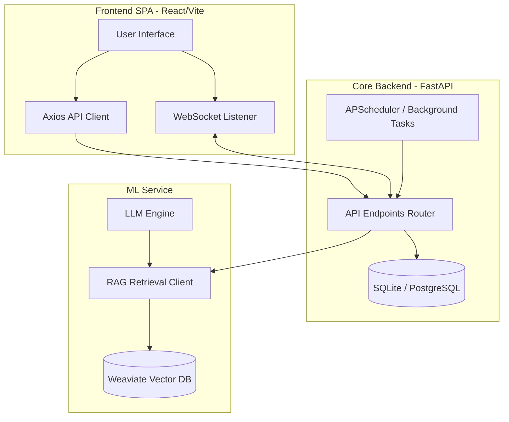

# Finsight System Architecture Blueprint

This document details the system architecture of the Finsight application, detailing the roles and relationships of each component layer.

---

## High-Level System Architecture

Finsight consists of three primary modules:
1. **Frontend UI**: Single-page application built using React, Vite, and styled with Tailwind CSS v4.
2. **Core Backend (FastAPI)**: Manages database persistence, authentication, billing (via Stripe integration), onboarding answers, and subscription tiers.
3. **ML Service**: Performs real-time sentiment analysis, RAG (Retrieval-Augmented Generation) document search, and structured insights classifications.

---

## Modules Breakdown

### 1. Core Backend (FastAPI)
- **FastAPI Framework**: Provides high-performance, asynchronous REST and WebSocket API endpoints.
- **Relational DB (SQLAlchemy)**: Manages user entities, sessions, token budgets, and subscriptions. Supports SQLite locally and PostgreSQL in production.
- **Entitlement Service**: Evaluates user subscriptions to enforce tiered access (Tier 1 to 4) on specific API operations.
- **Cron / Scheduling System**: Drives token wallet resets and triggers weekly performance digests via SES.

### 2. ML Service
- **LLM Engine**: Utilizes OpenAI structured outputs (`gpt-4o-mini`) to extract clean, JSON-conforming financial categories and topics.
- **Tavily Fallback Client**: Initiates live web searches when RAG context is insufficient to satisfy query trust parameters.
- **Weaviate Vector Database**: Hosts indexed PDF reports for Retrieval-Augmented Generation queries.

### 3. Frontend Client
- **Vite & React**: Fast compilation and SPA bundle execution.
- **Redux Toolkit**: Centralizes state management for subscription tiers and onboarding flows.
- **Tailwind CSS v4 & Glassmorphism**: Provides high-end styling cues, custom theme variables, and consistent layout tokens.
