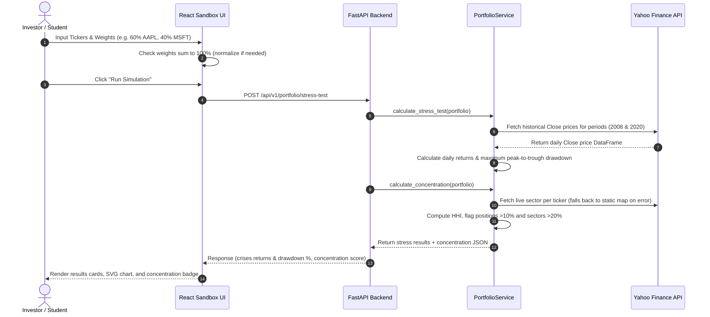
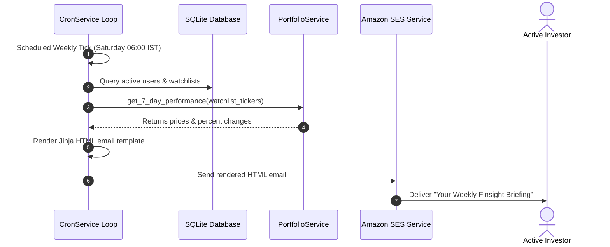
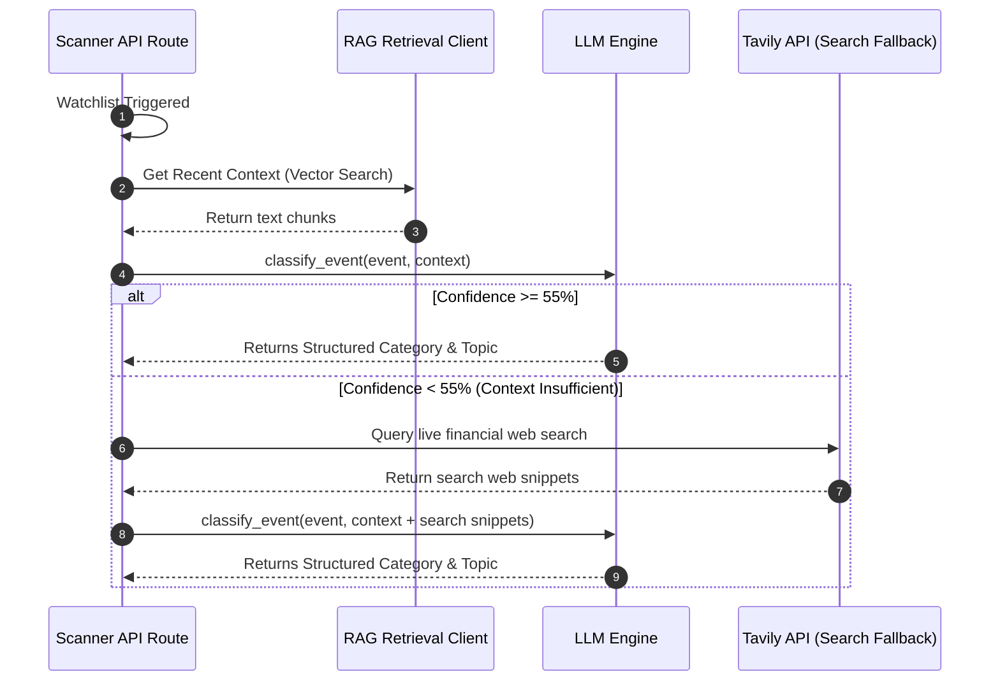
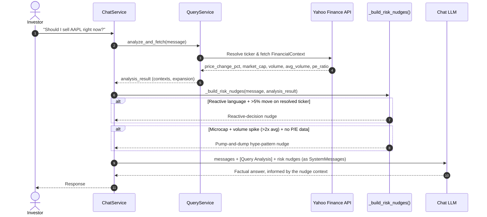

# Finsight Application Workflows

This document outlines key sequence and data workflows in the Finsight system using Mermaid diagrams.

---

## 1. Portfolio Stress-Testing Workflow
Illustrates the user flow when submitting a custom portfolio for historical crisis evaluation.
Since 2026-08-30, the same request also returns a concentration-risk score (see §4).

---

## 2. Weekly Email Briefings Delivery Workflow
Illustrates the background cron workflow delivering weekly briefings to Tier 4 subscribed users.

---

## 3. Real-Time Market Scanner Workflow
Illustrates how the market trigger scanner syncs live events and runs fallbacks.

---

## 4. Ask FinSight Risk-Nudge Workflow
Illustrates how a reactive-decision or pump-and-dump warning gets appended to the chat prompt,
using ticker data the pipeline was already going to fetch for the turn — no extra LLM call.

