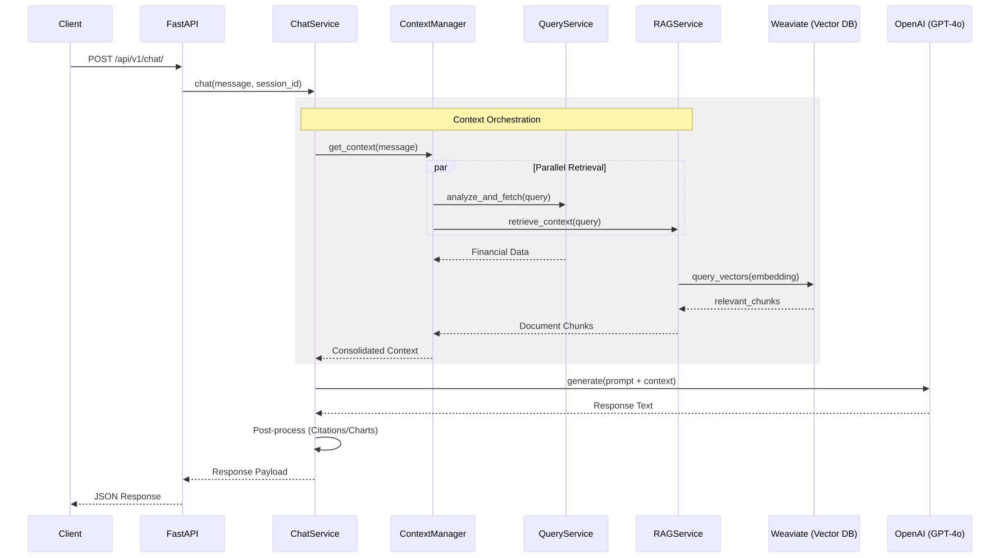
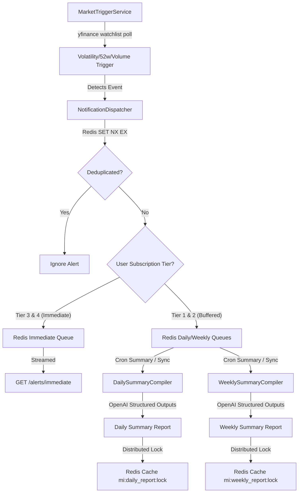
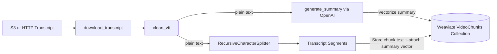
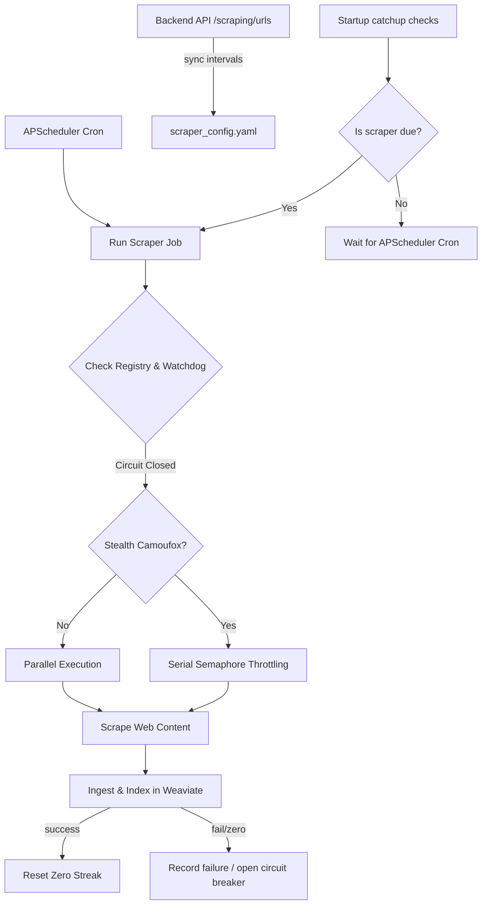
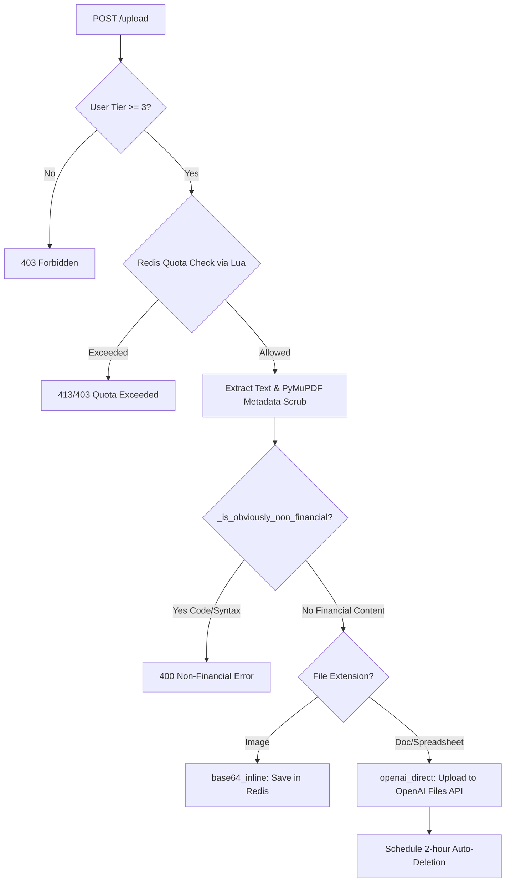

# Financial Intelligence API (p-finsight-ml)

A production-ready RAG (Retrieval-Augmented Generation) chatbot system for financial information, built with FastAPI, LangChain, Weaviate, and OpenAI.

---

## 🏗️ System Architecture

The application follows a clean, layered architecture with explicit dependency injection and a centralized container for service management.



---

## 🔄 Core Transitions & Logic Flows

### 1. Chat Orchestration (Sequence Diagram)
This diagram illustrates how `ChatService` coordinates between its managers to resolve context before generating a response.



### 2. Query Intelligence Pipeline
The `QueryService` uses a 3-step pipeline to transform natural language into structured financial data.



### 3. RAG Ingestion Flow
How documents are processed and stored in the vector database.


---

## 🧩 Core Architecture Pipelines

### 1. Tiered Insight Delivery Architecture
The tiered insight delivery system scans watched equities, classifies market events, and routes alerts dynamically depending on user subscriptions (Tiers 1-4).



- **Market Volatility Detection**: The `MarketTriggerService` continuously polls stock watchlists using `yfinance`. It triggers alarms on intraday price moves, 52-week highs/lows, and extreme volume spikes. The polling is executed on worker threads so that main server processes remain non-blocking.
- **Tiered Dispatching**: The `NotificationDispatcher` acts as the traffic controller. It checks user subscriptions and executes delivery routing:
  - **Redis Deduplication**: Checks incoming alerts against a Redis key using an atomic `SET NX EX` pattern, preventing redundant alert generation.
  - **Queue Routing**: Directs immediate notifications to immediate alert streams for premium tiers (Tiers 3 & 4), while buffering alerts into daily/weekly lists for free and basic tiers (Tiers 1 & 2).
- **Summary Compilers**: `DailySummaryCompiler` and `WeeklySummaryCompiler` run asynchronously to synthesize buffered alerts into structured financial summaries:
  - **OpenAI Structured Outputs**: Leverages structured LLM response formats (Pydantic schema validation) for predictable reporting schemas.
  - **Distributed Redis Locking**: Uses distributed lock keys (`mi:daily_report:lock` and `mi:weekly_report:lock`) to ensure that concurrent API calls do not trigger redundant compile tasks.
  - **Startup Cache Warming**: During API initialization, a background task (`_warm_weekly_reports_cache`) warms up weekly summary cache entries (`mi:weekly_report:tier:{id}`) to ensure instant loading for users.

---

### 2. Video Ingestion & Retrieval (RAG) Pipeline
The system integrates audio-visual media assets into the RAG environment via a specialized transcript analysis pipeline.



- **Clean Ingestion**: Downloads WebVTT transcripts from S3 or direct HTTP endpoints. The `clean_vtt` utility strips metadata headers, timestamps, and formatting cues to extract clean, continuous text.
- **LLM-Based Summarization**: OpenAI is queried to generate a global, high-density summary of the video transcript to capture thematic contexts.
- **Global Semantic Vector Strategy**: Instead of vectorizing isolated and noisy transcript fragments (which often leads to weak semantic search results):
  1. The global video summary is vectorized to generate a query embedding.
  2. The transcript is chunked into 500-character segments (with 100-character overlap) via `RecursiveCharacterTextSplitter`.
  3. All transcript chunks are stored in Weaviate’s `VideoChunks` collection, with **each chunk sharing the exact same summary vector** as its retrieval vector.
- **Semantic Retrieval & Cosine Similarity**: During search queries, retrieval is performed using pure vector matching. A strict cosine similarity threshold of `0.72` filters out weak matches, ensuring only semantically rich video segments are retrieved.

---

### 3. Scraper Scheduling & Dynamic Registry
The scraping engine is designed to run asynchronously in a single-loop container, preserving memory and integrating with backend API policies.



- **Dual-Mode Scheduling**:
  - **APScheduler Cron**: Schedules daily scrape runs at configured hours (e.g., `04:30 PM`).
  - **Startup Catch-Up**: At startup, `run_startup_check` scans history. If a scraper missed its run due to downtime, it triggers immediately.
- **Dynamic Website Registry**:
  - Maps numeric backend database IDs to internal scraper short-keys dynamically via `/api/v1/scraping/urls` on startup (using `scraper_mapping.py` with manual fallback).
  - Automatically updates and writes revised scraper interval schedules directly back to disk.
- **Throttling & Resource Serialization**:
  - Stealthed Firefox scrapers (`morgan_stanley`, `schwab`, `bofa_private_bank`, `goldmansachs`) are marked as `CAMOUFOX_SCRAPERS` and executed serially. This prevents concurrent launches from exhausting Docker shared memory (`/dev/shm`).
  - Other scrapers execute concurrently up to the configured worker limit.
- **Watchdog Circuit Breaker**:
  - Tracks consecutive successful runs. If a scraper fails or returns zero articles 3 times consecutively, the watchdog opens the circuit, skipping subsequent runs until it is manually reset or a cooldown window (24 hours) passes.
  - Periodic ghost-job sweeps reset orphaned `IN_PROGRESS` Redis statuses resulting from unexpected container crashes.

---

### 4. Document Upload Pipeline & Guardrails
A high-throughput document attachment service with strict security checks and atomic session rate limits.



- **Entitlement Checks**: Document uploads are restricted to premium tiers (Tier 3 and above). File limits are checked against the respective tier’s parameters.
- **Atomic Quota Reservation**:
  - Utilizes Redis Lua scripts (`UPLOAD_RESERVE_LUA` / `UPLOAD_ROLLBACK_LUA`) to atomically increment session-scoped document counts and token counters (`session_docs:{session_id}` / `session_tokens:{session_id}`).
  - If a file exceeds limits, the reservation is rejected; if the upload fails mid-process, the token reserve is rolled back.
- **Verification and Sanitization**:
  - **PDF Metadata Scrubbing**: Uses PyMuPDF to strip all metadata fields from PDFs prior to storage, blocking metadata-based prompt injections.
  - **Financial Content Heuristics**: Extracts text sample and runs `_is_obviously_non_financial(text)` check. Files containing heavy programming syntax (special character density > 15% or multiple coding keywords) are rejected to prevent domain abuse.
- **Ingestion Strategies**:
  - **`base64_inline`**: Stores images in Redis inline as base64 strings to feed multimodal LLMs.
  - **`openai_direct`**: Uploads PDFs, Word docs, and spreadsheets to the OpenAI Files API for native search and code-interpreter queries.
- **Automated Lifecycle**: To protect user privacy and manage cloud costs, uploaded OpenAI files are scheduled for automatic deletion 2 hours after upload.

---

## 🌟 Key Features

- **Advanced Query Analysis**: Dynamically classifies intent (e.g., price retrieval, comparative analysis, valuation) and extracts entities.
- **Hybrid Context**: Combines real-time market data (YFinance) with internal document knowledge (RAG).
- **Proactive Ticker Resolution**: Automatically maps company names to validated ticker symbols.
- **Streaming Support**: Real-time response streaming via Server-Sent Events (SSE).
- **Robust Session Management**: Persistent conversation history and entity tracking via Redis.
- **Granular Error Handling**: Specific HTTP status codes for LLM failures, rate limits, and analysis errors.

---

## 📋 Prerequisites

- **Docker & Docker Compose** (Recommended)
- **Python 3.11+** (For local development)
- **API Keys**:
  - `OPENAI_API_KEY` (Required)

---

## 🚀 Getting Started

### 1. Environment Setup
Create a `.env` file in the root directory:
```env
OPENAI_API_KEY=your_key_here
ENVIRONMENT=production
LOG_LEVEL=INFO
```

### 2. Run with Docker (Recommended)
```bash
docker-compose up -d
```
The API will be available at `http://localhost:8000`. You can access the Interactive Documentation at `http://localhost:8000/docs`.

Health endpoints:
- `GET /health/live`: process liveness probe
- `GET /health/ready`: readiness probe for Redis, Weaviate, prompts, required config, and a cached OpenAI canary
- `GET /health`: backward-compatible readiness alias

Direct readiness URL:
- `http://localhost:8000/health/ready`

Debugging tip:
- Open `http://localhost:8000/health/ready` in the browser or run `curl http://localhost:8000/health/ready`
- If the app returns `503`, check the `checks` section in the JSON response
- Each failed check tells you which dependency is blocking startup or traffic routing, such as `redis`, `weaviate`, `prompts`, `config`, or the cached `openai` canary
- This is useful when the container is up but the service should not yet receive production traffic

### 3. Local Development
```bash
# Install dependencies
pip install -r requirements.txt

# Run the server (ensure Redis and Weaviate are running)
python3 -m uvicorn src.api.main:app --reload
```

---

## 📂 Project Structure

```text
p-finsight-ml/
├── src/
│   ├── api/                # FastAPI routes, dependencies, and health Canary checking
│   │   ├── routes/         # Chat, Scraper, and User upload endpoints
│   │   └── main.py         # App entry point & background cache-warming trigger
│   ├── core/               # Shared interfaces, models, and Tier resolution policies
│   ├── services/           # Core business logic
│   │   ├── chat/           # Chat session/context/response managers
│   │   ├── rag/            # Document chunking & vector RAG implementation
│   │   ├── market_insights/# Volatility trigger, tiered notification routing, & summary compilation
│   │   ├── video/          # Clean audio-visual transcript ingestion & global summary vectorization
│   │   ├── uploads/        # PyMuPDF metadata scrub, financial content verification, & tier-quota reserves
│   │   ├── query_service.py# Query Intelligence engine
│   │   └── ticker_service.py# Ticker resolution logic
│   ├── data_sources/       # External data connectors (yFinance)
│   ├── llm/                # LLM clients, prompt profiles, and embedding models
│   ├── scripts/            # Standalone scraper scheduler, watchdog daemon, & ingestion catch-up tools
│   └── utils/              # Logging, Redis client pooling, and post-processors
├── config/                 # Pydantic settings & dynamic YAML config files (retrieval thresholds, prompt templates)
├── tests/                  # Unit and integration test suites
├── Dockerfile              # Container definition
└── docker-compose.yml      # Stack orchestration
```

---

## 🛠️ Configuration

Key settings in `config/settings.py` (overridable via environment variables):

| Variable | Default | Description |
|----------|---------|-------------|
| `MAX_CONTEXT_CHARS` | `15000` | Budget for contextual data |
| `REDIS_URL` | `redis://localhost:6379/0` | Session storage URL |
| `CHAT_HISTORY_TTL_SECONDS` | `259200` | Redis TTL for chat history cache |
| `MAX_MESSAGE_RETRIEVED` | `5` | Backend chat-history fetch limit, capped at `10` |
| `ML_DATA_TRANSFER_BASE_URL` | `https://api.chatfinsight.ai` | Backend API base for chat-history fallback |
| `ML_DATA_TRANSFER_TOKEN` | _required_ | Token sent as `x-ml-token` to the backend history API |
| `TIER_0_MODEL` to `TIER_5_MODEL` | `gpt-4.1-mini` | LLM model assigned to each tier (liteLLM format) |
| `TIER_0_QUOTA` to `TIER_5_QUOTA` | Variable | Daily request quota for each tier |
| `WEAVIATE_URL` | `http://localhost:8080` | Vector DB URL |
| `RATE_LIMIT_RPM` | `60` | Chat requests allowed per minute and client identity |
| `MAX_PARALLEL_YFINANCE_FETCHES` | `4` | Maximum concurrent yFinance fetches per process |
| `REDIS_SOCKET_TIMEOUT_SECONDS` | `3.0` | Redis socket timeout for async and sync clients |
| `YFINANCE_USE_BROWSER_SESSION` | `true` | Route yfinance through a browser-impersonated HTTP session |
| `YFINANCE_IMPERSONATE` | `chrome` | Browser fingerprint target for Yahoo Finance requests |
| `YFINANCE_HTTP_TIMEOUT_SECONDS` | `20` | Timeout for the browser-impersonated yfinance session |
| `MAX_UPLOAD_SIZE_BYTES` | `20971520` | Maximum file size for user uploads (default 20MB) |
| `MAX_DOCUMENT_TOKENS` | `50000` | Maximum total tokens allowed for attached docs in a session |
| `OPENAI_FILE_ID_TTL_SECONDS` | `86400` | Redis TTL for OpenAI file IDs (default 24 hours) |
| `TIER_FEATURES_CACHE_TTL_SECONDS` | `86400` | Redis TTL for user tier feature definition cache |
| `SESSION_STATE_TTL` | `86400` | Redis TTL for user session state |
| `VIDEO_SIMILARITY_THRESHOLD` | `0.72` | Cosine similarity threshold for video search |
| `WATCHDOG_ZERO_STREAK_THRESHOLD` | `3` | Number of zero-article scraper runs before circuit opens |
| `WATCHDOG_COOLDOWN_HOURS` | `24` | Cooldown hours for scraper watchdog before automatic reset |

### Yahoo Finance Transport

The yfinance data source now reuses one `curl_cffi` browser-impersonated session per process and passes
it into each `yf.Ticker(...)` call. This keeps the existing fetch workflow intact while making Yahoo
Finance requests look more like normal browser traffic in production.

If `curl_cffi` is temporarily unavailable, the service falls back to the default yfinance HTTP client so
local development and existing workflows continue to work.

### Traffic Control

Chat traffic now uses a Redis-backed fixed-window limiter. That means over-limit requests are rejected
immediately with `429` instead of being delayed inside the app, and the limit is consistent across
multiple app instances. If Redis is unavailable, the app falls back to a local in-memory limiter so the
service still protects itself.

### Retrieval Configuration

The system uses dynamic retrieval thresholds for RAG operations, configurable via `config/retrieval_config.yaml`:

```yaml
# Retrieval Configuration
# This file contains dynamic threshold settings for the RAG system's retrieval mechanism.
# Values can be overridden via environment variables.

# Minimum relevance score for retrieving scraped article chunks from vector database
# Balances recall (not missing relevant articles) vs precision (filtering noise)
min_article_relevance_score: 0.45

# Minimum relevance score for retrieving standard document chunks (PDFs, etc.)
# Higher threshold for more precise but potentially fewer results
min_document_relevance_score: 0.40

# Maximum number of top documents to retrieve before filtering by relevance score
rerank_top_k: 5
```

**Environment Variable Overrides** (highest priority):
- `MIN_ARTICLE_RELEVANCE_SCORE`: Override for article relevance threshold
- `MIN_DOCUMENT_RELEVANCE_SCORE`: Override for document relevance threshold  
- `RERANK_TOP_K`: Override for maximum retrieval count

These settings control how many and which document chunks are retrieved during RAG queries, balancing between finding relevant information and filtering noise.

## 📊 API Usage

### Chat Endpoint
`POST /api/v1/chat/`
```json
// Request
{
  "user_message": "What is the stock price of AAPL?",
  "session_id": "session-123",
  "is_new": true
}

// Response
{
  "assistant_message": "Apple Inc. (AAPL) is currently trading at...",
  "session_id": "session-123",
  "conversation_id": "session-123",
  "intent": "retrieve_price",
  "ticker": "AAPL",
  "citations": [
    {
      "source": "yfinance",
      "ticker": "AAPL",
      "data_type": "price",
      "confidence": 0.99
    }
  ],
  "sources": [
    {
        "source_type": "yfinance",
        "id": "AAPL",
        "retrieved_at": "2024-03-20T10:00:00Z"
    }
  ],
  "tokens_used": 150,
  "latency_ms": 1200
}
```

When `is_new` is `false`, the chat service first checks Redis for cached history. If the session is not
cached yet, it fetches up to the configured message limit from the backend chat-history API, writes the
normalized result back to Redis, and then uses that history as prompt context.

### Streaming Endpoint
`POST /api/v1/chat/stream`
```json
// Request
{
  "user_message": "Explain the latest Q3 earnings.",
  "session_id": "session-123",
  "is_new": true
}

// Response (Server-Sent Events)
data: {"type": "session", "data": {"session_id": "session-123"}}
data: {"type": "status", "data": "analyzing_query"}
data: {"type": "content", "data": "The"}
data: {"type": "content", "data": " latest"}
...
data: {"type": "metadata", "data": {"tokens_used": 300, "latency_ms": 2500}}
```

### Scraper/RAG Endpoint
`POST /api/v1/scraper/scrape`
```json
// Request
{
  "urls": ["https://example.com/report.pdf"],
  "store_in_vector_db": true
}

// Response
{
  "results": [
    {
      "url": "https://example.com/report.pdf",
      "status": "success",
      "content_length": 15000,
      "chunks_stored": 25,
      "metadata": {"title": "Annual Report 2024"}
    }
    }
  ],
  "total": 1,
  "successful": 1,
  "failed": 0
}
```

### Document Upload Endpoint
`POST /api/v1/uploads/upload`

Uploads a document for direct analysis by the LLM (bypassing the vector database).
```json
// Headers
// x-user-id: user-123
// x-session-id: session-456
// x-tier-id: 3

// Form-Data
// file: [binary]

// Response
{
  "status": "success",
  "filename": "report.pdf",
  "strategy": "openai_direct",
  "file_id": "file-xyz123",
  "message": "Successfully attached report.pdf for direct analysis."
}
```
*Note: Files are automatically deleted from OpenAI's servers after 2 hours.*

---

## 🧪 Testing

Run the test suite using `pytest`:
```bash
python3 -m pytest
```

---
*Created by the FinSight Team.*
